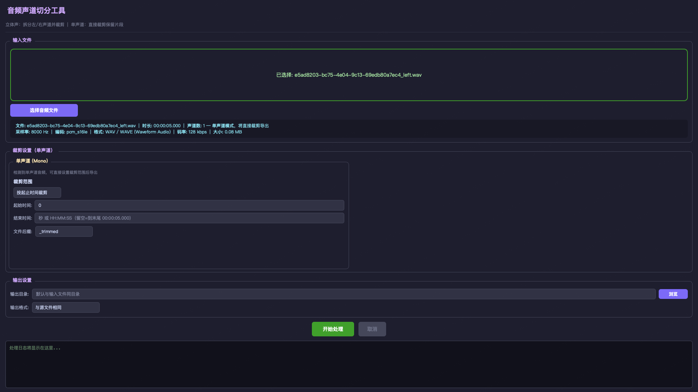
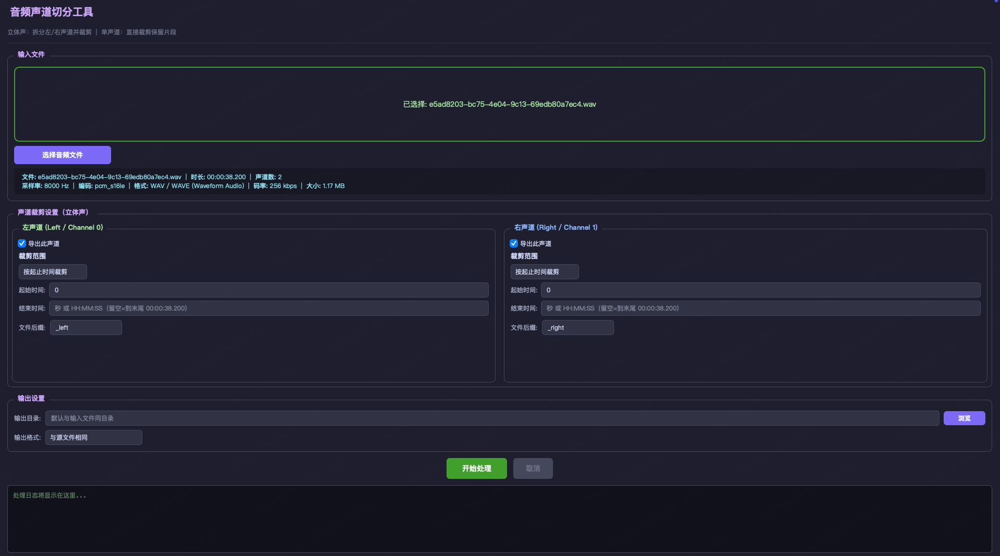

# 音频声道切分工具

将立体声音频文件的左/右声道分离导出，并支持指定保留的时间段；也支持对单声道音频直接裁剪。

## 界面预览

立体声模式（左右声道独立裁剪）：



单声道模式（直接裁剪导出）：



## 功能特性

- **声道分离**：将立体声（Stereo）音频拆分为独立的左声道、右声道单声道文件
- **单声道裁剪**：检测到单声道文件时自动切换为裁剪模式，直接导出指定片段
- **时间裁剪**：支持两种裁剪模式
  - 按起止时间裁剪（指定开始时间和结束时间）
  - 从头保留指定时长
- **灵活设置**：左右声道可独立配置裁剪参数和文件后缀
- **格式支持**：输出格式可选 WAV / MP3 / FLAC / AAC / OGG 或与源文件相同
- **拖放支持**：直接拖放音频文件到窗口

## 依赖要求

- Python 3.10+
- [ffmpeg](https://ffmpeg.org/) （需在系统 PATH 中）
- PyQt6

## 安装与运行

```bash
# 1. 创建虚拟环境（推荐）
python3 -m venv .venv
source .venv/bin/activate  # macOS/Linux
# .venv\Scripts\activate   # Windows

# 2. 安装依赖
pip install -r requirements.txt

# 3. 运行工具
python audio_channel_splitter.py
```

## 使用说明

1. 点击「选择音频文件」或将音频文件拖放到窗口
2. 查看文件信息（时长、声道数、采样率等）
3. 根据声道数自动切换面板：
   - **立体声**：分别为左/右声道设置裁剪范围，勾选需要导出的声道
   - **单声道**：直接设置裁剪范围，指定输出文件后缀
4. 设置输出目录和格式
5. 点击「开始处理」

## 支持的输入格式

MP3、WAV、FLAC、AAC/M4A、OGG、WMA、OPUS、AIFF 等 ffmpeg 支持的所有格式
